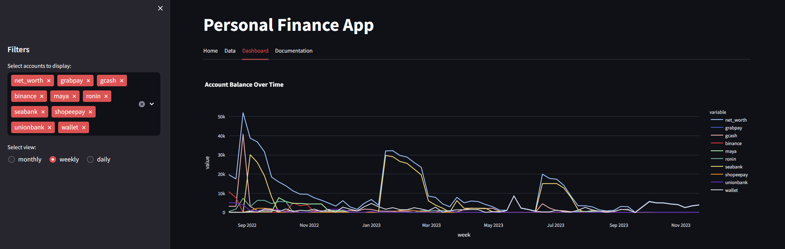
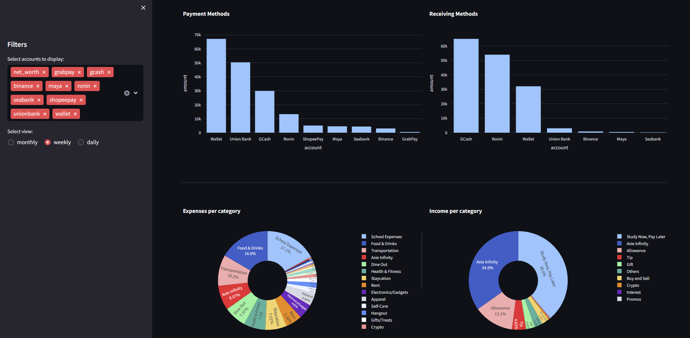
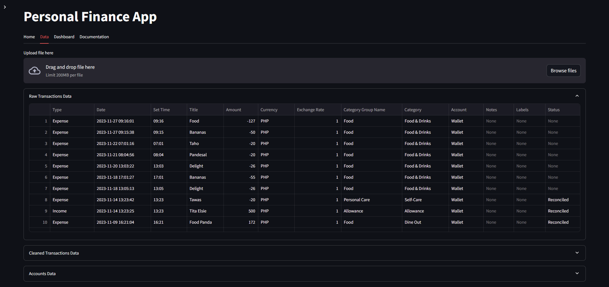
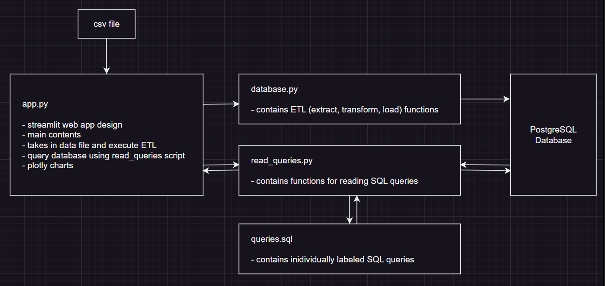

# Personal Finance Dashboard

A Personal Finance Dashboard built using **Python, Streamlit, PostgreSQL, Docker, Plotly, and Pandas** to analyze financial transactions and visualize spending patterns through an interactive dashboard.

## Features

* Upload transaction data in CSV format
* Interactive dashboard with filters
* Daily, Weekly, and Monthly expense analysis
* Income vs Expense visualization
* Category-wise expense breakdown
* Payment method analysis
* PostgreSQL database integration
* Dockerized application for easy deployment

## Tech Stack

* Python
* Streamlit
* PostgreSQL
* Docker
* Pandas
* SQLAlchemy
* Plotly

## Project Structure

```
personal-finance-dashboard/
├── scripts/
├── images/
├── Dockerfile
├── docker-compose.yaml
├── requirements.txt
└── README.md
```

## How to Run

```bash
docker compose up --build
```

Then open:

```
http://localhost:8501
```


## Screenshots

### Dashboard



### Dashboard Analytics



### Data Page



### Workflow



### finance


## Future Enhancements

* Budget prediction
* AI-powered expense insights
* Export reports to PDF/Excel
* User authentication
* Dark mode support

## Author

**Deepthi Reddy**
